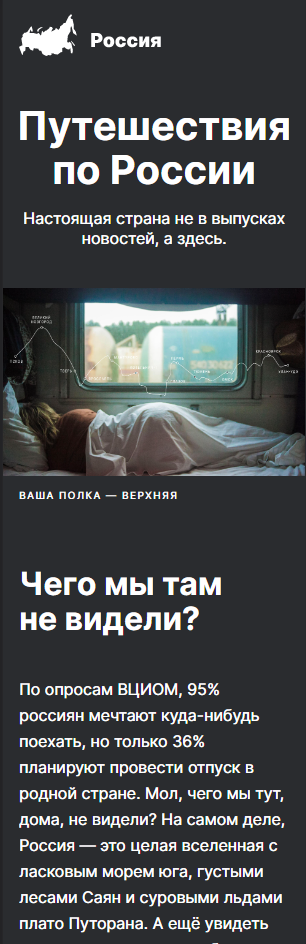

<!-- # Учебный проект "Путешествие по России"

## Технологии:
* Флексбокс-вёрстка
* Grid
* Адаптивная верстка
* Подключение шрифтов
* Файловая структура организована по методологии БЭМ Nested

Проект сверстан по макету из Figma, адаптирован под любую ширину экрана.

**Figma**

<a href="https://www.figma.com/file/5S2WSbEFL6awjVWJ0NWL8Q/Sprint-3_-Russia-_-desktop-mobile?node-id=28503%3A0/" target="_blank">Ссылка на макет в Figma</a>

<a href="https://nataliapushkina.github.io/russian-travel/" target="_blank">Ссылка на проект</a> -->

<h1>Учебный проект "Путешествие по России"</h1>

<ul>Технологии:</ul>

<li> Флексбокс-вёрстка</li>
<li> Grid</li>
<li>Адаптивная верстка</li>
<li> Подключение шрифтов</li>
<li> Файловая структура организована по методологии БЭМ Nested</li>

Проект сверстан по макету из Figma, адаптирован под любую ширину экрана.

<h2>
Ссылка на макет в Figma</a>

<a href="https://nataliapushkina.github.io/russian-travel/" target="_blank">Ссылка на проект</a>

